# �️ Nilüfer Akıllı Atık Yönetim Sistemi

**Yapay Zeka Destekli Platform**

  

---

## 📋 İçindekiler

- [Proje Hakkında](#proje-hakkında)
- [Özellikler](#özellikler)
- [Ekran Görüntüleri](#ekran-görüntüleri)
- [Kurulum](#kurulum)
- [Kullanım](#kullanım)
- [Sistem Mimarisi](#sistem-mimarisi)
- [Veritabanı Schema](#veritabanı-schema)
- [API Endpoints](#api-endpoints)
- [İstatistikler](#istatistikler)

---

## 🎯 Proje Hakkında

**Nilüfer Akıllı Atık Yönetim Sistemi** Bursa Nilüfer Belediyesi'nin atık yönetimini modernize etmek için geliştirilmiş web tabanlı bir platformdur.

### Hedefler:
- ✅ **Vatandaş katılımı** - Akıllı bildirim sistemi
- ✅ **Gerçek zamanlı izleme** - 2,567 konteynerin doluluk seviyeleri
- ✅ **Güven puanı sistemi** - Doğru bildirenler ödüllendirilir
- ✅ **Esnek yönetim** - Konteynırlar düzenlenebilir eklenebilir veya silinebilir
- ✅ **Admin onayı** - Kullanıcı bildirisi admin onay ekranında değerlendirilir

---

## ✨ Özellikler

### 👥 Vatandaş Uygulaması

#### 📝 **Bildirim Gönderme**
- Konteyner doluluk seviyesini fotoğrafla bildir
- Güven puanı sistemiyle doğru bildirilenler ödüllendirilir
- Admin onayına kadar bekleme durumunda kalır
- `+0.25` puan: Onaylanan bildirim
- `-0.25` puan: Reddedilen bildirim

#### 🗑️ **Konteynerleri Görüntüleme**
- 2,567 aktif konteynerin tümü
- Filtreleme ve arama
- Doluluk seviyesine göre renk kodlaması:
  - 🟢 Yeşil: < 50% (Az dolu)
  - 🟡 Sarı: 50-75% (Orta dolu)
  - 🔴 Kırmızı: ≥ 75% (Dolu)

#### 🏆 **Liderlik Tablosu**
- Top 10 vatandaş güven puanına göre
- Toplam bildirim sayısı gösterimi
- Aylık güncellemeler

#### 🌙 **Ek Özellikler**
- Koyu/Açık tema
- Oturum yönetimi

---

### 🛠️ İdari Panel

#### 📊 **Onay Bekleyen Raporlar**
- Anında görsel ile fotoğraflar
- Admin onay ve reddetme
- Konteyner doluluk seviyesi güncelleme

#### 👤 **Kullanıcı Yönetimi**
- Tüm vatandaşları görüntüleme
- Güven puanı takibi
- Bildirim geçmişi

#### 📈 **İstatistikler Paneli**
- Toplam konteyneyler: 2,567
- Dolu konteynerler: Real-time güncellemesi
- Ortalama doluluk oranı: 36.2%
- Aylık tonaj: CSV verileri

---

## 🎨 Ekran Görüntüleri

### 🔐 Kimlik Doğrulama

| Giriş Ekranı | Kayıt Ekranı |
|---|---|
| 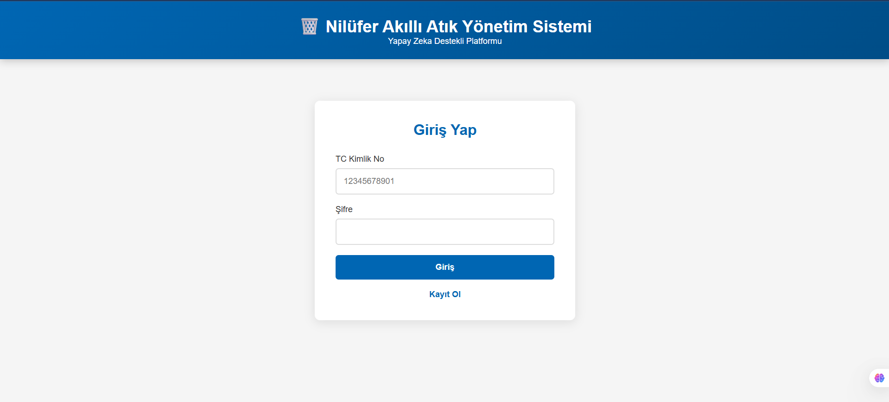 | 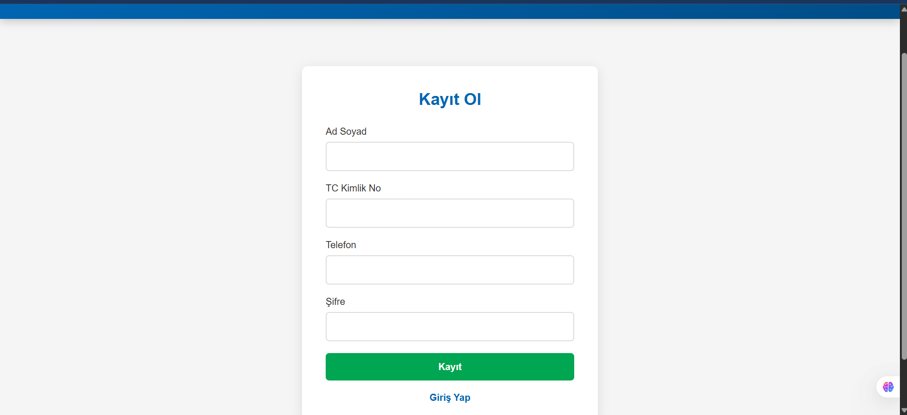 |

### 👥 Vatandaş Uygulaması

| Ana Menü | Konteynerler | Liderlik |
|---|---|---|
| 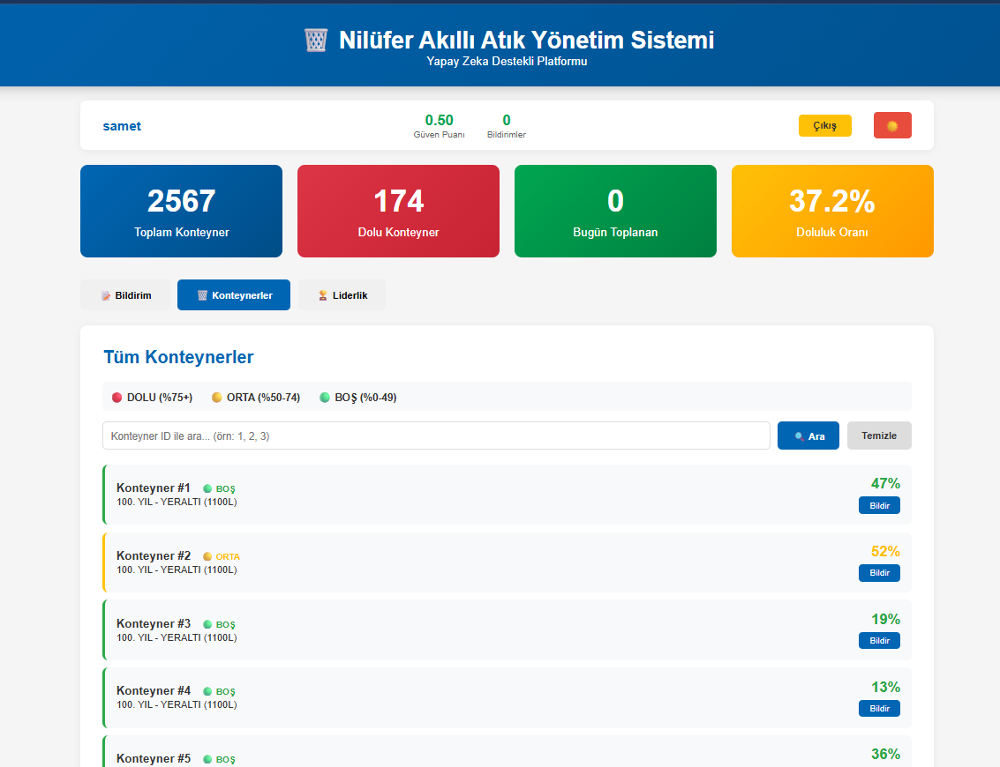 | 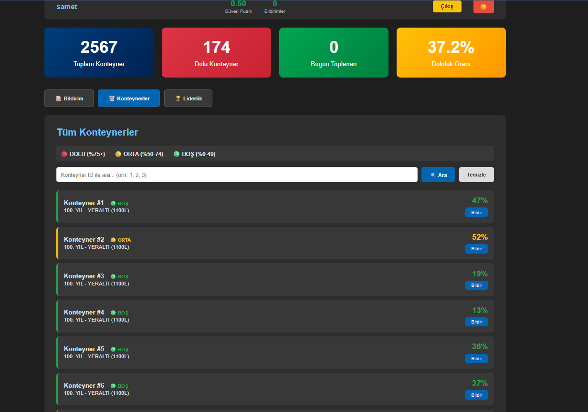 | 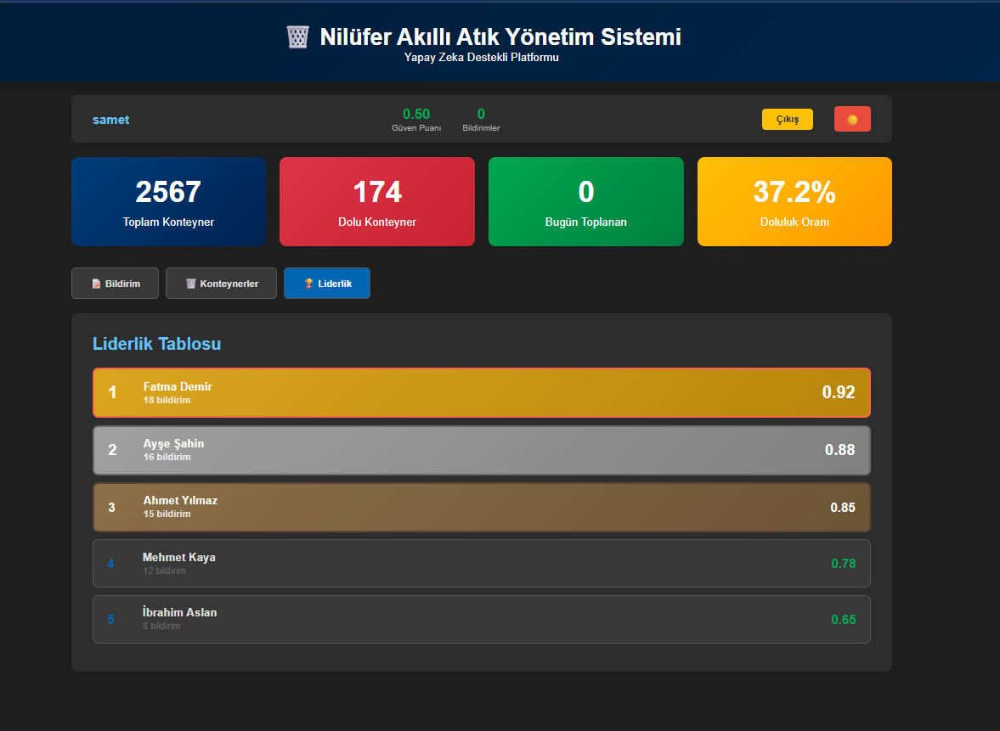 |

| Bildirim 1 | Bildirim 2 | Geçmiş |
|---|---|
| 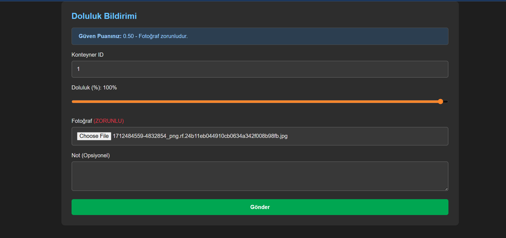 | 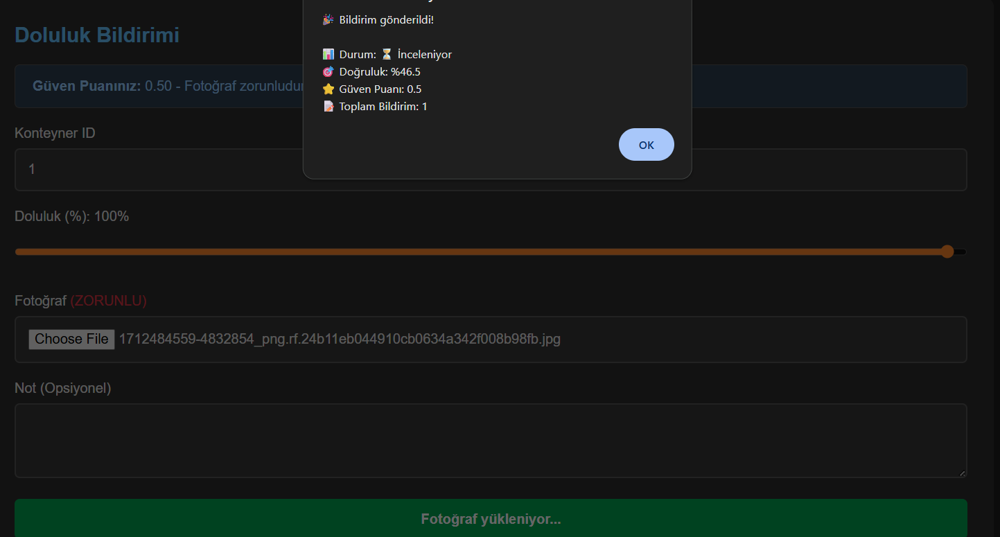 | 

### 🌙 Tema Seçenekleri

| Açık Tema | Koyu Tema |
|---|---|
|  | 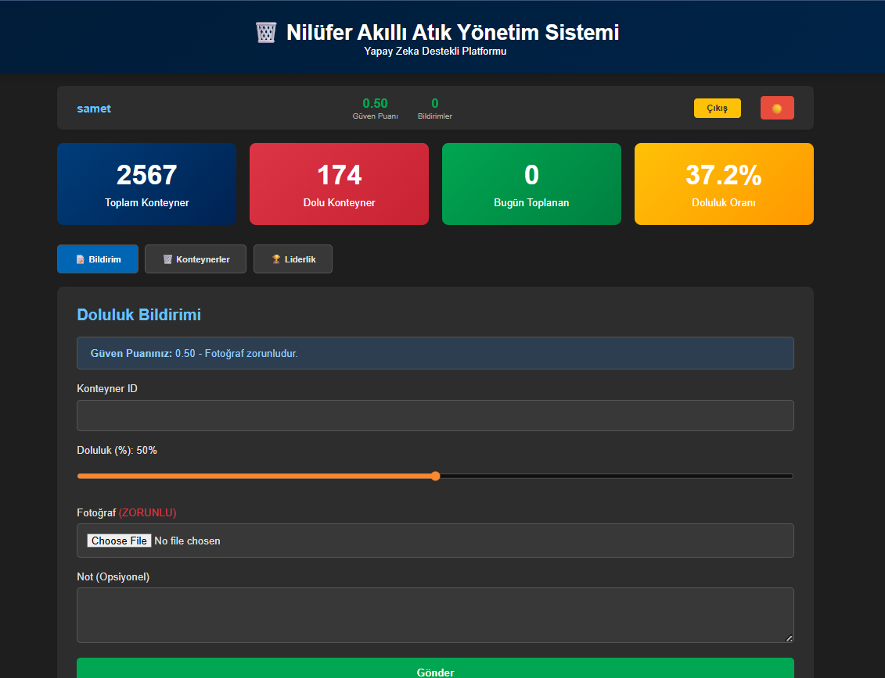 |

### 🛠️ İdari Panel

| Admin Paneli | Kullanıcı Yönetimi | İşlem Kaydı |
|---|---|---|---|
| 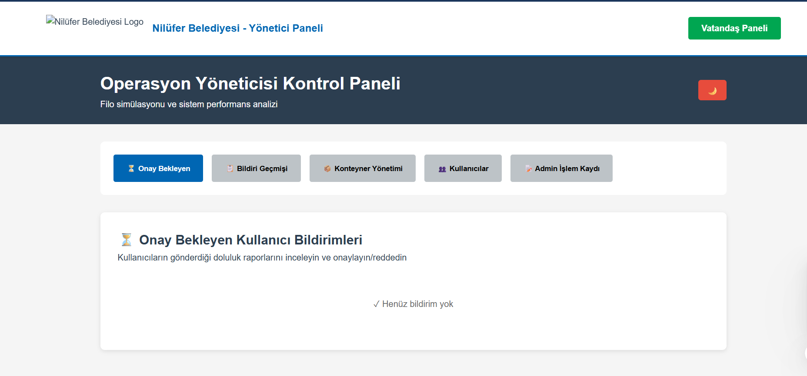 | 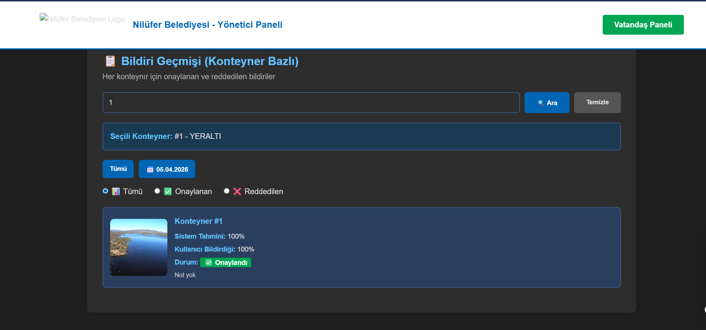 | 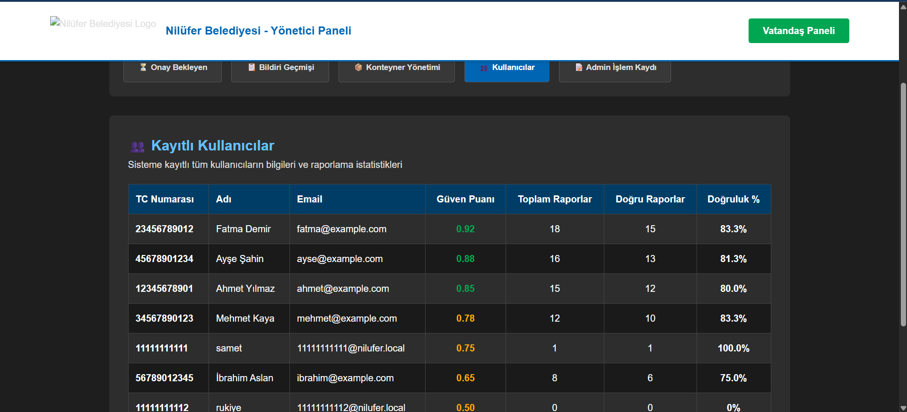 |  | 


### ✅ İşlemler

| Onay Bekleyen | Kabul Et | Reddet / Sil | Düzenle / Ekle |
|---|---|---|---|
| 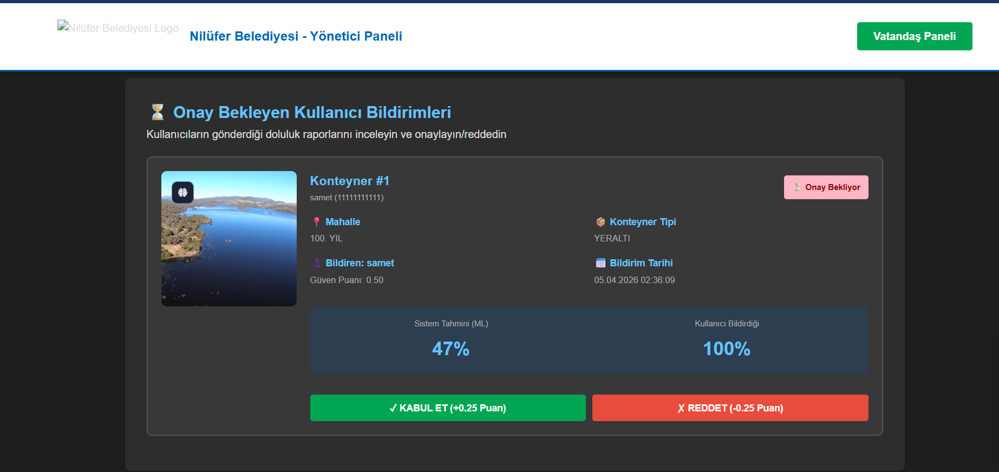 | 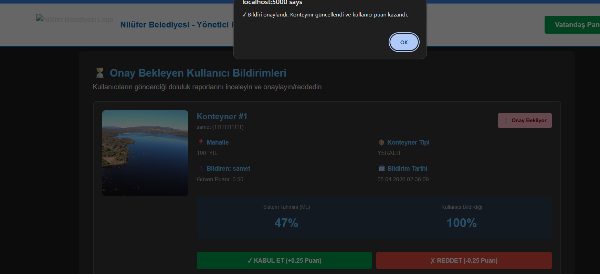 | 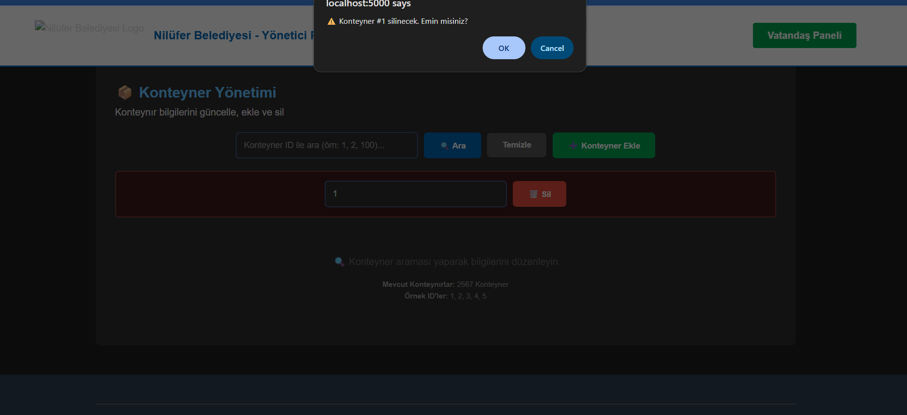 | 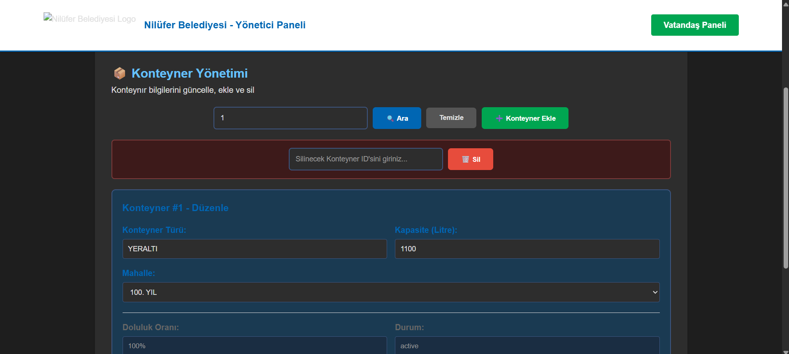 | 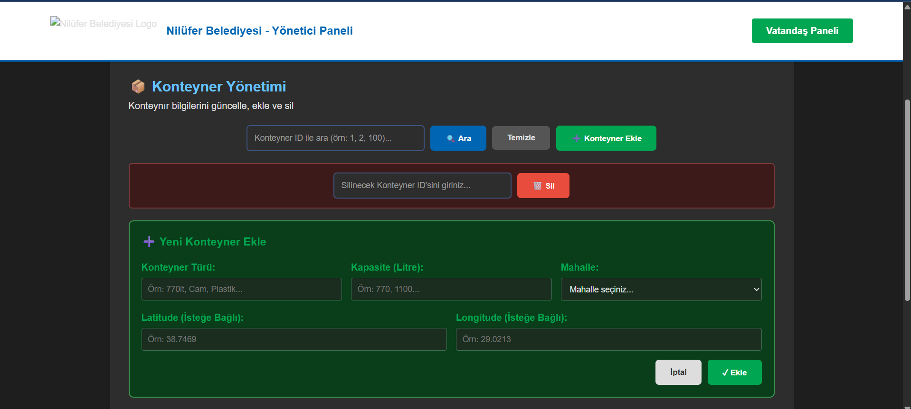 |

---

## 🚀 Kurulum

### Ön Gereksinimler

```bash
Python 3.10+
SQLite3
pip (Python paket yöneticisi)
```

### 1️⃣ Projeyi İndir

```bash
cd c:\Users\ASUS\OneDrive\Masaüstü\deneme
```

### 2️⃣ Gerekli Kütüphaneleri Yükle

```bash
pip install -r requirements.txt
```

### 3️⃣ Veritabanını Oluştur

```bash
python rebuild_database.py
```

**Çıktı:**
```
✓ 65 neighborhoods loaded
✓ 2,567 containers loaded
✓ 5 test users createde
```

### 4️⃣ Sunucuyu Başlat

```bash
python app_sqlite.py
```

**Çıktı:**
```
[OK] Model loaded
[INFO] Database: nilufer_waste.db
[INFO] API URLs:
  Citizen App: http://localhost:5000/
  Admin Panel: http://localhost:5000/admin
```

---

## 📖 Kullanım

### 🔐 Giriş Bilgileri (Test Hesapları)

| Adı | TC Numarası | Şifre |
|-----|------------|-------|
| Ahmet Yılmaz | 12345678901 | sifre123 |
| Fatma Demir | 23456789012 | sifre123 |
| Mehmet Kaya | 34567890123 | sifre123 |
| Ayşe Şahin | 45678901234 | sifre123 |
| İbrahim Aslan | 56789012345 | sifre123 |

### 📱 Vatandaş Uygulaması Kullanım Adımları

1. **Sayfaya Gir**
   - URL: `http://localhost:5000/`

2. **Yeni Hesap Aç** (İsteğe bağlı)
   - "Kayıt Ol" linkine tıkla
   - Ad, TC (11 haneli), Telefon, Şifre gir
   - İlk puan başlangıç: **0.50**

3. **Giriş Yap**
   - TC ve Şifre ile oturum aç

4. **Bildirim Gönder**
   - "📝 Bildirim" sekmesine tıkla
   - Konteyner ID: Gir (1-2567)
   - Doluluk: Slider ile ayarla (%)
   - **Fotoğraf: ZORUNLU** ✓
   - Not: İsteğe bağlı
   - "Fotoğraf Yükle" tıkla

5. **Konteynerleri Gözat**
   - "🗑️ Konteynerler" sekmesi
   - Arama ve filtreleme yapabilirsin

6. **Puanlarını Takip Et**
   - "🏆 Liderlik" sekmesi
   - Kendi sıralamanı ve puanını gör

---

### 🛠️ Admin Paneli Kullanım

1. **Admin Paneline Gir**
   - URL: `http://localhost:5000/admin`

2. **Onay Bekleyen Raporları Gözden Geçir**
   - "Onay Bekleyen" sekmesinde raporları gör
   - Fotoğraf: Raporun kanıtı
   - ML Tahmini: Sistem tarafından hesaplanan doluluk
   - Kullanıcı Bildirdiği: Vatandaşın bildirdiği doluluk

3. **Raporu Onayla veya Reddet**
   - "✅ KABUL ET" - Konteyner güncelle, kullanıcıya +0.25 puan
   - "❌ REDDET" - Rapor reddedildi, kullanıcıya -0.25 puan

---

## 🏗️ Sistem Mimarisi

### Klasör Yapısı

```
deneme/
├── app_sqlite.py              # Flask Backend
├── rebuild_database.py        # Veritabanı oluşturma
├── requirements.txt           # Python bağımlılıkları
├── nilufer_waste.db          # SQLite Veritabanı
├── models/
│   └── fill_predictor.pkl    # ML model
├── data/
│   ├── address_data.csv
│   ├── container_counts.csv
│   └── fleet.csv
└── public/
    ├── index.html
    ├── script.js
    ├── styles.css
    └── photos/
```

---

## 🔌 API Endpoints

### Kimlik Doğrulama

**POST /api/auth/register** - Yeni hesap
**POST /api/auth/login** - Giriş yap

### Bildirim

**POST /api/reports/submit** - Bildirim gönder
**GET /api/admin/pending-reports** - Onay bekleyen
**POST /api/admin/approve-report** - Rapor onayla
**POST /api/admin/reject-report** - Rapor reddet

### Veri

**GET /api/dashboard/stats** - Dashboard istatistikleri
**GET /api/containers/all** - Tüm konteynerler
**GET /api/leaderboard** - Liderlik tablosu

---

## 📊 İstatistikler

| Metrik | Değer |
|--------|-------|
| Mahalleler | 65 |
| Konteynerler | 2,567 |
| Araçlar | 45 |
| Test Kullanıcıları | 5 |
| Örnek Bildirimler | 50 |
| Nüfus (Nilüfer) | 7,861,750 |
| Ort. Doluluk | 36.2% |

---

## Ekibimiz
* [Ahmed Said](https://github.com/Ahos9) - [kullanıcı paneli düzenlemeleri],
  
Abdussamet Türkoğlu - [admin paneli düzenlemeleri]

**Projeyi kullan, test et ve feedback gönder!** 🚀

